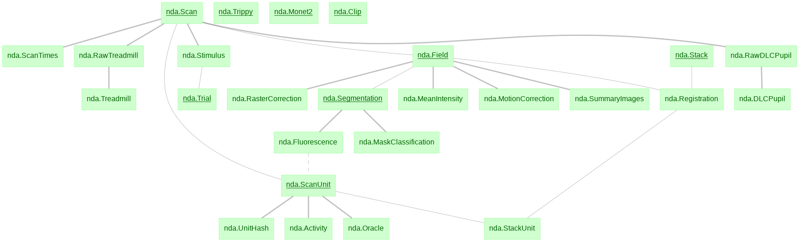

# microns_phase3_nda
nda schema for MICrONS phase3 animal 21617. For more on the MICrONS project please see: [MICrONS Explorer](https://www.microns-explorer.org/)

## Technical documentation
Technical documentation on the functional data can be found [here (link pending)]().

## Installation Instructions
This package requires access to the functional data. To download the SQL database get started on the microns-nda-access repo [here](https://github.com/cajal/microns-nda-access).

## Import Instructions

Import datajoint. Configuration instructions: https://docs.datajoint.io/python/setup/01-Install-and-Connect.html

```python
import datajoint as dj
```

## Using the schema

To view schema ERD:
```python
dj.ERD(nda)
```



## Tutorial: 

[Using DataJoint to Access Functional Data Tutorial](tutorial_notebooks/Using_DataJoint_to_Access_Functional_Data.ipynb) 

## nda table descriptions

**nda.Scan:** Information on completed scans. Cajal Pipeline: [meso.ScanInfo](https://github.com/cajal/pipeline/blob/6a8342bf3edb07f5653c61024742258295cd8014/python/pipeline/meso.py#L29)

**nda.Field:** Individual fields of scans. Cajal Pipeline: [meso.ScanInfo.Field](https://github.com/cajal/pipeline/blob/6a8342bf3edb07f5653c61024742258295cd8014/python/pipeline/meso.py#L54)

**nda.RasterCorrection:** Digital correction for bidirectional scanning alignment. Cajal Pipeline:[meso.RasterCorrection](https://github.com/cajal/pipeline/blob/3fb4d51051f72a64e5cc2c7190a2cc2fd77d63b6/python/pipeline/meso.py#L385)

**nda.MotionCorrection:** Digital correction for lateral movement of the tissue beneath the objective. Cajal Pipeline: [meso.MotionCorrection](https://github.com/cajal/pipeline/blob/3fb4d51051f72a64e5cc2c7190a2cc2fd77d63b6/python/pipeline/meso.py#L456)

**nda.ScanTimes:** Timestamps of scan frames in seconds relative to the start of the scan for the first pixel of the first imaging field.

**nda.MeanIntensity:** Mean intensity of imaging field over time. Cajal Pipeline: [meso.Quality.MeanIntensity](https://github.com/cajal/pipeline/blob/fa202ee43437a67d55719e8ae9769ee9937581d0/python/pipeline/meso.py#L173)

**nda.SummaryImages:** Reference images of the scan field. Cajal Pipeline: [meso.SummaryImages](https://github.com/cajal/pipeline/blob/921a920478c73687dd78b863fcd05e12bbf1e197/python/pipeline/meso.py#L571)

**nda.Segmentation:** CNMF segmentation of a field using CaImAn package (https://github.com/simonsfoundation/CaImAn). It records the masks of all segmented cells. Mask_id's are unique per field. Cajal Pipeline: [meso.Segmentation.Mask](https://github.com/cajal/pipeline/blob/921a920478c73687dd78b863fcd05e12bbf1e197/python/pipeline/meso.py#L765)

**nda.Fluorescence:** Records the raw fluorescence traces for each segmented mask. Cajal Pipeline: [meso.Fluorescence.Trace](https://github.com/cajal/pipeline/blob/921a920478c73687dd78b863fcd05e12bbf1e197/python/pipeline/meso.py#L1159)

**nda.ScanUnit:** Unit_id assignment that is unique across the entire scan. Includes info about each unit. Cajal Pipeline: [meso.ScanSet.Unit / meso.ScanSet.UnitInfo](https://github.com/cajal/pipeline/blob/921a920478c73687dd78b863fcd05e12bbf1e197/python/pipeline/meso.py#L1341)

**nda.UnitHash:** Hash assignment to each unique session - scan_idx - unit_id triplet.

**nda.Activity:** Deconvolved spike trace from the fluorescence trace. Cajal Pipeline: [meso.Activity.Trace](https://github.com/cajal/pipeline/blob/921a920478c73687dd78b863fcd05e12bbf1e197/python/pipeline/meso.py#L1501)

**nda.MaskClassification:** Classification of segmented masks into soma or artifact. Uses CaImAn package (https://github.com/simonsfoundation/CaImAn). Cajal Pipeline: [meso.MaskClassification.Type](https://github.com/cajal/pipeline/blob/6f44fdbd186905d95a9a86d6d60ad147df24f9e2/python/pipeline/meso.py#L1478)

**nda.Oracle:** Leave-one-out correlation for repeated videos in stimulus.

**nda.Stack:** High-res anatomical stack information. Cajal Pipeline: [stack.CorrectedStack](https://github.com/cajal/pipeline/blob/6a8342bf3edb07f5653c61024742258295cd8014/python/pipeline/stack.py#L733)

**nda.Registration:** Parameters of the affine matrix learned for field registration into the stack. Cajal Pipeline: [stack.Registration.Affine](https://github.com/cajal/pipeline/blob/6a8342bf3edb07f5653c61024742258295cd8014/python/pipeline/stack.py#L1333)

**nda.StackUnit:** Unit coordinates in stack reference frame after field registration. [meso.StackCoordinates.UnitInfo](https://github.com/cajal/pipeline/blob/921a920478c73687dd78b863fcd05e12bbf1e197/python/pipeline/meso.py#L1672)

**nda.Stimulus:** For each scan, contains the movie aligned to activity traces in `nda.Activity`.

**nda.Trial:** Contains information for each trial of the movie in `nda.Stimulus`. There are three types of trials, `Clip`, `Monet2`, and `Trippy`. Each unique trial has its own `condition_hash`. To get detailed information for each trial stimulus, join each `condition_hash` according to its corresponding type in one of: `nda.Clip`, `nda.Monet2`, or `nda.Trippy`.

**nda.Clip:** Detailed information for movie clips.

**nda.Monet2:** Detailed information for the Monet2 stimulus.

**nda.Trippy:** Detailed information for the Trippy stimulus.

**nda.RawDLCPupil:** Pupil traces for each scan from the left eye collected at ~20 Hz and automatically tracked in DeepLabCut. Cajal Pipeline: [Pupil.Eye](https://github.com/cajal/pipeline/blob/3fb4d51051f72a64e5cc2c7190a2cc2fd77d63b6/python/pipeline/pupil.py#L76) and [Pupil.FittedPupil.Ellipse](https://github.com/cajal/pipeline/blob/3fb4d51051f72a64e5cc2c7190a2cc2fd77d63b6/python/pipeline/pupil.py#L845)

**nda.DLCPupil:** Manual pupil traces low-pass filtered with a hamming window to the scan frame rate and linearly interpolated to scan frame times.

**nda.RawTreadmill:** Cylindrical treadmill rostral-caudal position extracted with a rotary optical encoder at ~100Hz and converted into velocity.  Cajal Pipeline: [treadmill.Treadmill](https://github.com/cajal/pipeline/blob/3fb4d51051f72a64e5cc2c7190a2cc2fd77d63b6/python/pipeline/treadmill.py#L18)

**nda.Treadmill:** Treadmill velocities low-pass filtered with a hamming window to the scan frame rate then linearly interpolated to scan frame times.

For more documentation see: [Cajal Pipeline Documentation](https://cajal.github.io/atlab-docs.github.io/pipeline.html)

## Acknowledgement of Government Sponsorship

Supported by the Intelligence Advanced Research Projects Activity (IARPA) via Department of Interior / Interior Business Center (DoI/IBC) contract number D16PC00003. The U.S. Government is authorized to reproduce and distribute reprints for Governmental purposes notwithstanding any copyright annotation thereon. Disclaimer: The views and conclusions contained herein are those of the authors and should not be interpreted as necessarily representing the official policies or endorsements, either expressed or implied, of IARPA, DoI/IBC, or the U.S. Government.